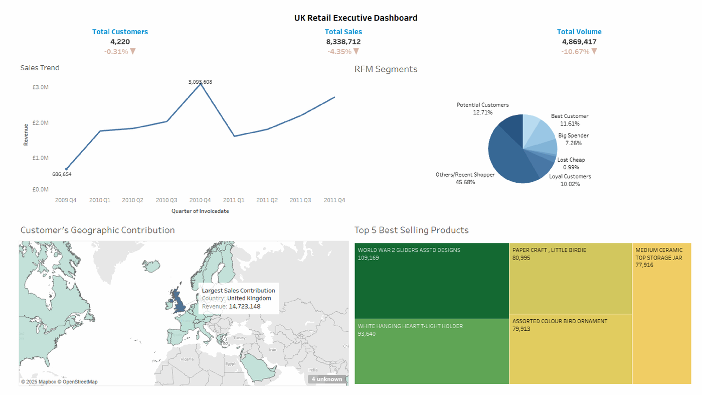
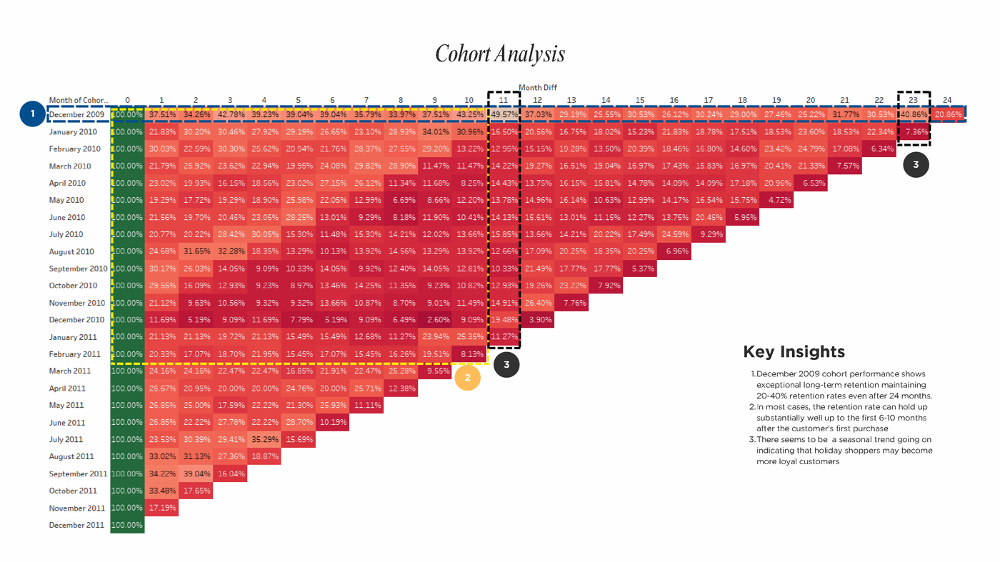
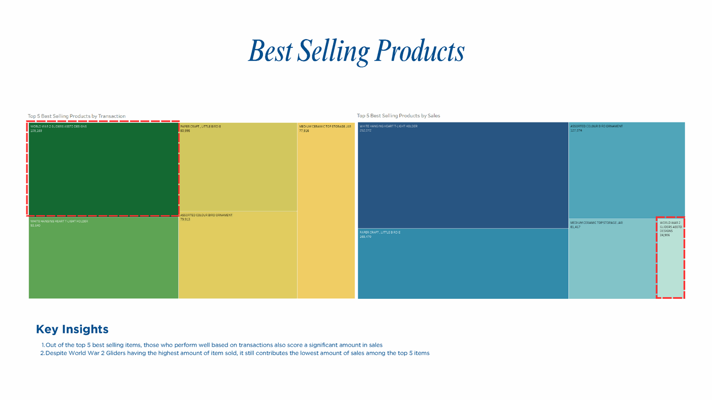

# 📊 Projects

A collection of data analysis and machine learning coursework, spanning regression, classification, clustering, and exploratory analysis in both Python and R.

---

## ✈️ [Data Expo 2002-2003 Airline Time Data.ipynb](Data%20Expo%202002-2003%20Airline%20Time%20Data.ipynb)

An end-to-end analysis of **11.7 million US domestic flight records** (2002–2003), structured around five investigative questions.

**Approach:**
- 🧹 Merged the 2002 and 2003 raw CSVs, verified there were no cancelled flights to exclude, and engineered a single `delay` variable (`ArrDelay + DepDelay`) as the basis for all five questions
- 📅 **Q1 — Timing:** Grouped delay by day-of-week and scheduled time to find the lowest-delay windows
- ✈️ **Q2 — Aircraft age:** Cross-referenced plane manufacture year against delay to test whether older aircraft fly worse
- 📈 **Q3 — Traffic trends:** Tracked flight volume between locations over time
- 🔗 **Q4 — Cascading delays:** Correlated departure delay against arrival delay across the network
- 🤖 **Q5 — Predictive modeling:** Built and compared four regression models to predict arrival delay from `Month`, `DayOfWeek`, `CRSDepTime`, `CRSArrTime`, `ActualElapsedTime`, `DepDelay`, and `Distance`

**Why compare four models?** The features are a mix of a near-linear driver (`DepDelay`, given Q4's finding that it strongly correlates with `ArrDelay`) and weaker, noisier predictors (schedule/time features). Linear Regression tests how far a simple linear fit gets; Lasso and Ridge test whether regularizing away the noisier features helps generalization; Random Forest tests whether the noisier features actually hide non-linear interactions a linear model can't capture.

**Result of the assessment:**

| Model | R² | MSE |
|---|---|---|
| Random Forest | **0.975** | **37.98** |
| Linear Regression | 0.939 | 93.84 |
| Ridge Regression | 0.939 | 93.86 |
| Lasso Regression | 0.842 | 242.82 |

Random Forest wins outright here — its ability to model non-linear interactions between the schedule/time features and delay meaningfully outperforms the linear approaches, meaning the relationship isn't purely linear. Lasso underperforms Ridge/Linear, suggesting its regularization penalty removed signal the model needed rather than just noise.

**Key findings:** Saturday and ~3:30 AM departures see the lowest average delay; departure delay strongly predicts arrival delay (evidence of cascading effects); Random Forest is the strongest predictor of arrival delay among the four models tested.

<table>
<tr>
<td></td>
<td></td>
</tr>
<tr>
<td></td>
<td></td>
</tr>
</table>

---

## 🚗 [Vehicle-Price-Regression-Analysis.R](Vehicle-Price-Regression-Analysis.R)

Predicts car price from the Kaggle **CarPrice** dataset using three regression techniques of increasing complexity.

**Approach:**
- 🧹 Dropped identifier columns, removed duplicates, and used the **IQR method** to strip outliers from `price`
- 📊 Explored feature distributions and correlations before modeling
- ✂️ 80/20 train-test split (`caTools`, seed-fixed for reproducibility)
- 📐 **Multiple Linear Regression** — fit, then refined with **backward stepwise elimination** to drop non-significant predictors
- 🌳 **CART (Decision Tree)** — grown to full depth, then **cost-complexity pruned** using the 1-SE rule on cross-validated error
- 🌲 **Random Forest** (500 trees) — with permutation-based variable importance

**Evaluation:** All three models scored on **RMSE** and **R²**, ranked in a summary table. `enginesize`, `curbweight`, and `horsepower` consistently emerged as the strongest predictors across CART and Random Forest importance rankings.

---

## 📞 [Customer-Churn-Clustering-and-Classification.R](Customer-Churn-Clustering-and-Classification.R)

A two-part analysis of **telecom customer churn** — first unsupervised (who are the customer segments?), then supervised (can we predict who churns?).

**Approach — Unsupervised:**
- 🧹 Cleaned and recoded status labels, imputed missing values with the median, removed outliers from `Total_Revenue`
- 📉 **PCA** to understand variance structure — the first 6 components capture 76% of variance, driven by tenure/charges, age, and long-distance usage patterns
- 🎯 **K-means** (k=2, chosen via the silhouette method) — validated with **ANOVA**, confirming the two clusters differ significantly in tenure and revenue
- 🌿 **Hierarchical clustering** (Ward linkage) as a second, independent segmentation to cross-check the K-means result

**Approach — Supervised classification:**
- ✂️ 80/20 train-test split, features scaled for the linear model
- 📐 **Logistic Regression** as the interpretable baseline
- 🌳 **Decision Tree** with a confusion-matrix heatmap for visual diagnostics
- 🌲 **Random Forest** — importance ranking flagged `Contract`, `Monthly_Charge`, and `Tenure` as the top churn drivers

**Evaluation:** Accuracy, Precision, Recall, and macro-averaged **F1** across all three classifiers — each landing around **85% accuracy**, ranked in a final comparison table.

---

## 🛒 [Kaggle Superstore Data.ipynb](Kaggle%20Superstore%20Data.ipynb)

Exploratory analysis of retail superstore sales, asking where sales come from and where profit actually leaks.

**Approach:**
- 🧹 Cleaned and processed raw sales records, checked for missing values
- 📈 Trend-lined sales and profit over time
- 🗂️ Broke down performance by **category**, **region**, and **customer segment**
- 📉 Correlation matrix to sanity-check relationships between sales, profit, and discount
- 📐 A simple **Linear Regression** (`Profit ~ Sales + Quantity + Discount`) to quantify the discount-profit relationship directly

**Key findings:** Office Supplies is the most-purchased category, but Technology drives the most profit — suggesting a possible rebalancing opportunity away from Furniture. Discounting measurably hurts profit margins rather than growing volume enough to offset it.

<table>
<tr>
<td></td>
<td></td>
</tr>
</table>

---

## 🛍️ [Online-Retail-Customer-Analytics-Dashboard.pdf](Online-Retail-Customer-Analytics-Dashboard.pdf)

Capstone project from the **Dibimbing** data analytics bootcamp (Batch 14): a full customer analytics and retention study on a UK-based online retail dataset (Dec 2009 – Dec 2011, ~1.07M transactions), built around three business problems — understanding transactional behaviour, identifying best-selling products, and figuring out how to retain existing customers.

**Approach:**
- 🧹 **Pre-processing:** Removed rows missing `CustomerID` (~22% of the data — customer identity is essential for the segmentation work) and filtered out non-positive quantities, landing on 824,364 clean rows
- 📊 **RFM Analysis** — scored every customer on **Recency**, **Frequency**, and **Monetary** value, then bucketed them into named segments (Best Customer, Loyal Customers, Big Spender, Potential Customers, Lost Cheap, Almost Lost, etc.) to prioritize retention effort
- 📈 **Cohort Analysis** — tracked month-by-month retention for each signup cohort to see how long customers keep buying
- 📋 **Executive Dashboard** — a single-page view combining sales trend, RFM segment mix, geographic revenue contribution, and top-selling products for stakeholders

**Key findings:**
- The UK dominates the customer base (£14.7M of revenue vs. £621K for the next-largest market, Ireland) — a concentration risk as well as a strength
- Sales peaked in **Q4 2010** and show a recurring seasonal spike heading into every Q4, but overall 2011 volume and sales declined 4–10% versus 2010
- The **December 2009 cohort** retained exceptionally well — 20–40% of customers were still purchasing 24 months later — but across cohorts generally, **the first 6–10 months after first purchase** is the critical window where most customers churn
- **45.68%** of customers fall into the "Others/Recent Shopper" segment, the single largest RFM bucket, ahead of Loyal Customers (10.02%) and Best Customer (11.61%)

**Recommendations proposed:** a loyalty points program, targeted re-engagement campaigns timed to the 6–10 month churn window, seasonal Q4 promotions, and expansion into the EIRE/Netherlands markets to reduce UK concentration risk.

<table>
<tr>
<td></td>
<td></td>
</tr>
</table>

---

## 🧰 Tech Stack

